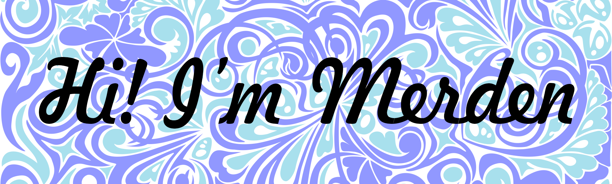

<h2>About me :sunglasses:</h2>

I'm a C# developer. 
  I like drawing, science, math and math algorithms. 
  Are you an employer? <a href="">Visit my website portfolio</a> 
  See my artworks on <a href="https://www.deviantart.com/merdenhran">DeviantArt</a>

<h2>Contribution Graph 📊</h2>

<!--
**MerdenHran/MerdenHran** is a ✨ _special_ ✨ repository because its `README.md` (this file) appears on your GitHub profile.

Here are some ideas to get you started:

- 🔭 I’m currently working on ...
- 🌱 I’m currently learning ...
- 👯 I’m looking to collaborate on ...
- 🤔 I’m looking for help with ...
- 💬 Ask me about ...
- 📫 How to reach me: ...
- 😄 Pronouns: ...
- ⚡ Fun fact: ...
-->
