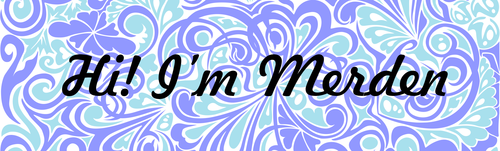

<h1>About me</h1>
I'm a C# developer.
I like drawing, science, math and math algorithms.
Are you an employer? <a href="">Visit my website portfolio</a>
My <a href="https://www.deviantart.com/merdenhran">DeviantArt</a>

<!--
**MerdenHran/MerdenHran** is a ✨ _special_ ✨ repository because its `README.md` (this file) appears on your GitHub profile.

Here are some ideas to get you started:

- 🔭 I’m currently working on ...
- 🌱 I’m currently learning ...
- 👯 I’m looking to collaborate on ...
- 🤔 I’m looking for help with ...
- 💬 Ask me about ...
- 📫 How to reach me: ...
- 😄 Pronouns: ...
- ⚡ Fun fact: ...
-->
